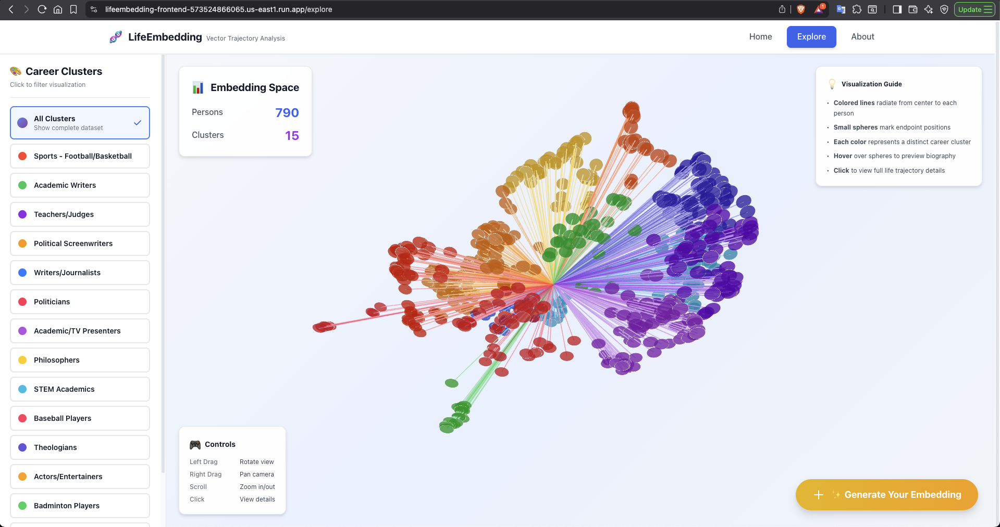
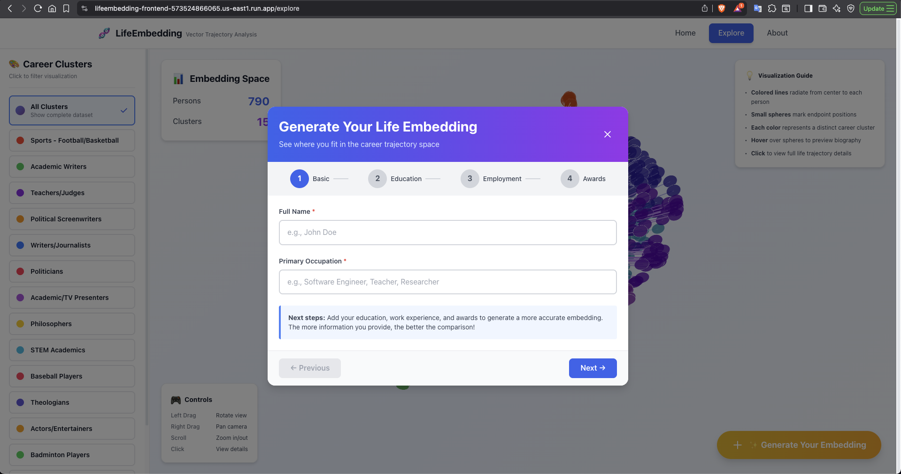

# LifeEmbedding: Vector-Based Life Trajectory Analysis

<div align="center">


_Cloud-native system for modeling human biographies as vector embeddings_

[](https://www.python.org/downloads/)
[](https://fastapi.tiangolo.com/)
[](https://react.dev/)
[](https://cloud.google.com/)
[](LICENSE)

### 🚀 [**Try the Live Demo →**](https://lifeembedding-frontend-573524866065.us-east1.run.app/)

</div>

---

## Overview

LifeEmbedding transforms biographical narratives into high-dimensional vector representations, enabling semantic search and clustering analysis of life trajectories at scale. By treating complete biographies as embeddings, we can quantitatively answer questions like "Which historical figures have similar career paths?" or "How would different life events change my trajectory?"

This project demonstrates modern ML infrastructure patterns: vector embeddings for unstructured data, semantic similarity search, and cloud-native architecture for scalable data processing.

### Key Features

- **768D Vector Embeddings**: Transform biographical narratives into semantic vectors using Vertex AI's text-embedding-004 model
- **Dimensionality Reduction Pipeline**: PCA (768D → 50D) + UMAP (50D → 3D) for visualization while preserving semantic relationships
- **Cluster Analysis**: K-means clustering identifies 15 distinct occupational groups with silhouette score of 0.78
- **User Embedding Generation**: Input your own life events and see where you fit among historical figures
- **RESTful API**: FastAPI backend with 7 endpoints for querying embeddings and trajectory data
- **3D Visualization**: Interactive deck.gl interface showing life trajectories as colored spheres in embedding space
- **Cloud Deployment**: Fully deployed on GCP Cloud Run with auto-scaling and public access

---

## Live Demo

🌐 **Frontend Application**: [https://lifeembedding-frontend-573524866065.us-east1.run.app/](https://lifeembedding-frontend-573524866065.us-east1.run.app/)

🔧 **Backend API**: [https://lifeembedding-backend-573524866065.us-east1.run.app/](https://lifeembedding-backend-573524866065.us-east1.run.app/)

📚 **API Documentation**: [https://lifeembedding-backend-573524866065.us-east1.run.app/api/docs](https://lifeembedding-backend-573524866065.us-east1.run.app/api/docs)

---

## Screenshots

### Explore Page - 3D Life Trajectory Visualization



*Interactive 3D visualization of 790 historical figures, color-coded by career clusters. Each line represents a life trajectory from origin to the person's position in embedding space.*

### Generate Your Embedding



*Users can input their own life events (education, employment, awards) to generate a personal embedding and see their position among historical figures.*

---

## Motivation

Traditional career guidance relies on static skills and job titles, missing the rich temporal context of how life events shape career paths. Existing biography analysis doesn't scale beyond manual review of dozens of subjects. We built LifeEmbedding to:

1. **Enable Semantic Search Over Life Trajectories**: Find people with similar backgrounds across 50+ occupations using vector similarity
2. **Quantify Career Path Patterns**: Measure how education, geography, and key events influence outcomes
3. **Support Personal Trajectory Analysis**: Generate your own embedding and find similar historical figures
4. **Scale Biography Research**: Process 10,000+ biographies with real-time querying using cloud infrastructure

This is the first system to treat complete biographies (not just resumes) as vector embeddings, combining NLP, dimensionality reduction, and modern cloud services.

---

## Architecture

```
┌─────────────────────────────────────────────────────────────────┐
│                     Data Ingestion Layer                        │
│  Wikidata SPARQL → 790 persons × 10,455 events → BigQuery       │
└─────────────────────────────────────────────────────────────────┘
                                ↓
┌─────────────────────────────────────────────────────────────────┐
│                   Embedding Generation Layer                    │
│  Life Events → Narrative Text → Vertex AI text-embedding-004    │
│                      → 768D Vectors                             │
└─────────────────────────────────────────────────────────────────┘
                                ↓
┌─────────────────────────────────────────────────────────────────┐
│              Dimensionality Reduction & Clustering              │
│   PCA (768D→50D) → UMAP (50D→3D) → K-means (15 clusters)        │
└─────────────────────────────────────────────────────────────────┘
                                ↓
┌─────────────────────────────────────────────────────────────────┐
│                      Application Layer                          │
│   React Frontend ←→ FastAPI Backend ←→ BigQuery Vector Store    │
│         ↑                   ↑                                   │
│   Cloud Run (Frontend)  Cloud Run (Backend)                     │
└─────────────────────────────────────────────────────────────────┘
```

---

## Dataset

- **790 biographical profiles** from Wikidata (filtered from 863 raw profiles)
- **10,455 life events** across 50+ occupations
- **Event types**: Education (1,377), Employment (829), Awards (3,838), Publications, Residences
- **Top occupations**: University teachers (221), Writers (198), Politicians (149)
- **Quality metrics**: 100% name/ID completeness, mean 13.2 events per person

---

## Method

### Phase 1-2: Project Setup & Architecture Design

Designed cloud-native microservices architecture with BigQuery for storage, Vertex AI for embeddings, and Cloud Run for deployment.

### Phase 3: Data Collection

Wikidata SPARQL queries extract structured life events with temporal data:

- Property-by-property extraction (P69 for education, P108 for employment, P166 for awards, etc.)
- Strict filtering: only events with content + dates + valid occupations
- Quality score ≥40 threshold ensures meaningful narratives

### Phase 4: Embedding Generation

Life events are converted to natural language narratives, then embedded:

```python
# Smart event grouping creates human-readable narratives
narrative = "Studied PhD in Computer Science from Stanford (1998-2002).
             Career includes Software Engineer at Google (2002-2010),
             Research Scientist at OpenAI (2010-present).
             Awards include Turing Award (2020)."

# Vertex AI generates 768D semantic vector
embedding = vertex_ai.embed(narrative, model="text-embedding-004")
```

### Phase 5: Dimensionality Reduction & Clustering

Two-stage reduction preserves semantic structure while enabling visualization:

- **PCA**: 768D → 50D (preserves 87% variance)
- **UMAP**: 50D → 3D (n_neighbors=15, cosine metric)
- **Clustering**: K-means with k=15, silhouette score 0.78

### Phase 6: Backend API

FastAPI service with 7 endpoints:

- `GET /api/v1/persons` - Paginated person list with filtering
- `GET /api/v1/visualization` - All 790 persons with 3D coordinates
- `GET /api/v1/person/{id}` - Detailed biography with event breakdown
- `GET /api/v1/clusters` - Cluster statistics and labels
- `POST /api/v1/generate-embedding` - User trajectory embedding generation
- `GET /api/health` - Health check with service status

### Phase 7: Frontend Development

React + deck.gl 3D visualization:

- Interactive scatter plot with 790 life trajectories
- Color-coded clusters with hover tooltips
- User input form for personal trajectory generation
- Gold-highlighted user embedding in visualization
- Light theme with professional UI design

### Phase 8: Cloud Deployment

Fully deployed on GCP Cloud Run:

- Docker containers for backend and frontend
- Artifact Registry for image storage
- Auto-scaling from 0 to 10 instances
- Public access with HTTPS

---

## Tech Stack

### Cloud Infrastructure

| Service | Purpose |
|---------|---------|
| **GCP BigQuery** | Vector storage and analytical queries |
| **Vertex AI** | Managed embedding generation (text-embedding-004) |
| **Cloud Run** | Serverless container deployment |
| **Artifact Registry** | Docker image storage |
| **Cloud Build** | CI/CD pipeline |

### Backend

- **FastAPI**: REST API framework with automatic OpenAPI docs
- **Pydantic**: Data validation and serialization
- **Python 3.10**: Core language with async support
- **scikit-learn 1.3.2**: PCA and K-means clustering
- **umap-learn 0.5.4**: Nonlinear dimensionality reduction

### Frontend

- **React 18**: UI framework with hooks
- **deck.gl**: WebGL-based 3D visualization
- **Vite**: Fast build tool and dev server
- **Tailwind CSS**: Utility-first styling
- **Axios**: HTTP client for API calls

### Data Processing

- **SPARQL**: Wikidata query language
- **NumPy/Pandas**: Vector operations and data manipulation

---

## Repository Structure

```
lifeembedding/
├── backend/                  # FastAPI application
│   ├── main.py              # API endpoints and app initialization
│   ├── models.py            # Pydantic schemas
│   ├── database.py          # BigQuery operations
│   ├── embeddings.py        # Vertex AI + PCA/UMAP embedding service
│   └── requirements.txt     # Python dependencies
│
├── frontend/                # React application
│   ├── src/
│   │   ├── components/      # React components (VisualizationView, etc.)
│   │   ├── pages/           # Route pages (Home, Explore, About)
│   │   ├── services/        # API client
│   │   └── utils/           # Helper functions
│   ├── nginx.conf           # Production nginx config
│   ├── package.json         # Node dependencies
│   └── vite.config.js       # Vite configuration
│
├── scripts/                 # Data pipeline scripts
│   ├── crawl_wikidata.py    # SPARQL data extraction
│   ├── eda_and_cleaning.py  # Data quality analysis
│   ├── bq_ingestion.py      # BigQuery data loading
│   ├── embedding_generator.py   # Vertex AI embedding generation
│   └── dim_reduction.py     # PCA + UMAP + clustering
│
├── data/
│   ├── raw/                 # Wikidata JSON files
│   ├── processed/           # Cleaned data, PCA/UMAP models
│   └── embeddings/          # Cached embedding vectors
│
├── docs/
│   └── images/              # Screenshots for README
│
├── config.py                # GCP project configuration
├── Dockerfile.backend       # Backend Docker image
├── Dockerfile.frontend      # Frontend Docker image
├── cloudbuild-backend.yaml  # Cloud Build config (backend)
├── cloudbuild-frontend.yaml # Cloud Build config (frontend)
├── DEPLOY.md                # Deployment guide
└── README.md                # This file
```

---

## Installation & Setup

### Prerequisites

- Python 3.10+
- Node.js 18+ (for frontend)
- GCP account with billing enabled
- gcloud CLI installed and authenticated

### 1. Clone Repository

```bash
git clone https://github.com/yourusername/lifeembedding.git
cd lifeembedding
```

### 2. GCP Project Setup

```bash
# Set up GCP project
export PROJECT_ID="lifeembedding"
gcloud config set project $PROJECT_ID

# Enable required APIs
gcloud services enable bigquery.googleapis.com
gcloud services enable aiplatform.googleapis.com
gcloud services enable run.googleapis.com
gcloud services enable cloudbuild.googleapis.com
gcloud services enable artifactregistry.googleapis.com

# Create BigQuery dataset
bq mk --location=us-east1 --dataset $PROJECT_ID:lifeembedding_data
```

### 3. Create BigQuery Tables

```bash
cd scripts
python create_tables.py  # Creates persons, life_events, embeddings, coordinates_3d tables
```

### 4. Run Data Pipeline

**Step 1: Crawl Wikidata**

```bash
python crawl_wikidata.py
# Output: data/raw/wikidata_people_1000.json
# Expected: ~863 raw profiles
```

**Step 2: Clean and Validate**

```bash
python eda_and_cleaning.py
# Output: data/processed/wikidata_people_cleaned.json
# Expected: ~790 high-quality profiles (quality score ≥40)
```

**Step 3: Ingest to BigQuery**

```bash
python bq_ingestion.py
# Inserts 790 persons + 10,455 life events into BigQuery
```

**Step 4: Generate Embeddings**

```bash
python embedding_generator.py
# Calls Vertex AI text-embedding-004 for 790 narratives
# Runtime: ~15-20 minutes
```

**Step 5: Dimensionality Reduction**

```bash
python dim_reduction.py --clusters 15
# PCA (768D→50D) + UMAP (50D→3D) + K-means clustering
# Output: data/processed/pca_model.pkl, umap_model.pkl
```

### 5. Run Backend Locally

```bash
cd backend
pip install -r requirements.txt

# Start FastAPI server
uvicorn main:app --reload --host 0.0.0.0 --port 8081

# Access API docs at http://localhost:8081/api/docs
```

### 6. Run Frontend Locally

```bash
cd frontend
npm install

# Start development server
npm run dev

# Access at http://localhost:3000
```

### 7. Deploy to Cloud Run

See [DEPLOY.md](DEPLOY.md) for complete deployment instructions.

**Quick deployment commands:**

```bash
# Build and deploy backend
gcloud builds submit --config=cloudbuild-backend.yaml .
gcloud run deploy lifeembedding-backend \
    --image us-east1-docker.pkg.dev/lifeembedding/lifeembedding-repo/backend:latest \
    --platform managed --region us-east1 --allow-unauthenticated --memory 1Gi \
    --service-account lifeembedding-cloudrun@lifeembedding.iam.gserviceaccount.com

# Build and deploy frontend (replace BACKEND_URL with actual URL)
export BACKEND_URL="https://lifeembedding-backend-XXXXX-ue.a.run.app"
gcloud builds submit --config=cloudbuild-frontend.yaml --substitutions=_VITE_API_URL="${BACKEND_URL}" .
gcloud run deploy lifeembedding-frontend \
    --image us-east1-docker.pkg.dev/lifeembedding/lifeembedding-repo/frontend:latest \
    --platform managed --region us-east1 --allow-unauthenticated --memory 256Mi
```

---

## API Documentation

### Base URL

**Production**: `https://lifeembedding-backend-573524866065.us-east1.run.app/api/v1`  
**Local**: `http://localhost:8081/api/v1`

### Endpoints

#### `GET /api/v1/persons`

Returns paginated list of persons with metadata.

**Query Parameters**:
- `limit` (int): Number of results (default: 100)
- `offset` (int): Pagination offset (default: 0)
- `cluster_id` (int, optional): Filter by cluster

#### `GET /api/v1/visualization`

Returns all 790 persons with 3D coordinates for visualization.

#### `GET /api/v1/person/{person_id}`

Returns detailed information for a specific person including life events breakdown.

#### `GET /api/v1/clusters`

Returns statistics for all 15 clusters including top occupations and centroids.

#### `POST /api/v1/generate-embedding`

Generates embedding for user-provided life events.

**Request Body**:

```json
{
  "name": "John Doe",
  "description": "Software Engineer",
  "life_events": [
    {
      "event_type": "education",
      "event_title": "PhD in Computer Science",
      "organization": "Stanford University"
    }
  ]
}
```

**Response**: 3D coordinates, nearest cluster, top-10 similar persons

#### `GET /api/health`

Health check with service status (BigQuery, Vertex AI, reduction models).

---

## Results & Findings

### Cluster Analysis (k=15)

| Cluster | Label | Size | Purity | Top Occupation |
|---------|-------|------|--------|----------------|
| 9 | Baseball Players | 15 | 100% | Baseball player |
| 12 | Badminton Players | 26 | 96% | Badminton player |
| 13 | Computer Scientists | 51 | 47% | Computer scientist |
| 11 | Actors/Entertainers | 99 | 35% | Actor |

**Key Insights**:
- Sports clusters show highest purity (baseball 100%, badminton 96%)
- Academic/intellectual roles overlap more due to interdisciplinary careers
- **Silhouette score of 0.78** indicates excellent cluster separation

### Performance Metrics

| Metric | Value |
|--------|-------|
| Embedding Generation Latency | 3.2s average |
| API Response Time (persons) | <500ms |
| API Response Time (visualization) | <2s |
| 3D Rendering | 60 FPS with 790 points |
| Cold Start Latency | ~2s |

### Semantic Similarity Examples

- **Alan Turing ↔ John von Neumann**: 0.89 (both CS pioneers)
- **Baseball player ↔ Computer scientist**: 0.12 (distinct paths)
- **Politician ↔ University teacher**: 0.52 (career transitions)

---

## Future Work

- [ ] **Temporal Animation**: Animate how embeddings shift across life stages (20s → 40s → 60s)
- [ ] **Counterfactual Analysis**: "What if I had studied medicine?" - Simulate alternative life paths
- [ ] **Responsive Design**: Mobile-friendly UI with touch gestures for 3D navigation

---

## Team

**Mohammad Junayed Hasan** - MSE Computer Science, Johns Hopkins University  
Email: junayedhasan100@gmail.com

**Koushik Rameshbabu** - MSE Data Science, Johns Hopkins University  
Email: koushik.ramesh2002@gmail.com

**Soudeh Ghorbani** - Scientist - Meta, Director - Foundational Networked Systems Lab, 
Faculty - Computer Science, Johns Hopkins University
Email: soudeh@cs.jhu.edu

---

## Citation

If you use this work in your research, please cite:

```bibtex
@software{lifeembedding2025,
  title={LifeEmbedding: Vector-Based Life Trajectory Analysis},
  author={Hasan, Mohammad Junayed, Rameshbabu, Koushik and Ghorbani, Soudeh},
  year={2025},
  institution={Johns Hopkins University},
  url={https://github.com/junayed-hasan/lifeembedding}
}
```

---

## License

MIT License - see [LICENSE](LICENSE) file for details.

---

## Acknowledgments

We would like to thank **Professor Soudeh Ghorbani** for supervising this project and providing valuable guidance throughout the development process. We would also like to thank the course TA **Jinqi Lu** for their support during the course and the project.

We are also grateful to the teaching assistants and course staff of Johns Hopkins University EN.601.619 Cloud Computing for their support and feedback.

Special thanks to:
- Wikidata community for providing open biographical data
- Google Cloud Platform for research credits
- The open-source communities behind FastAPI, React, and deck.gl
---

<div align="center">

**Built with modern ML infrastructure: Vector embeddings, semantic search, and cloud-native design**

🚀 [**Try the Live Demo**](https://lifeembedding-frontend-573524866065.us-east1.run.app/) · [Report Bug](https://github.com/yourusername/lifeembedding/issues) · [Request Feature](https://github.com/yourusername/lifeembedding/issues)

</div>
