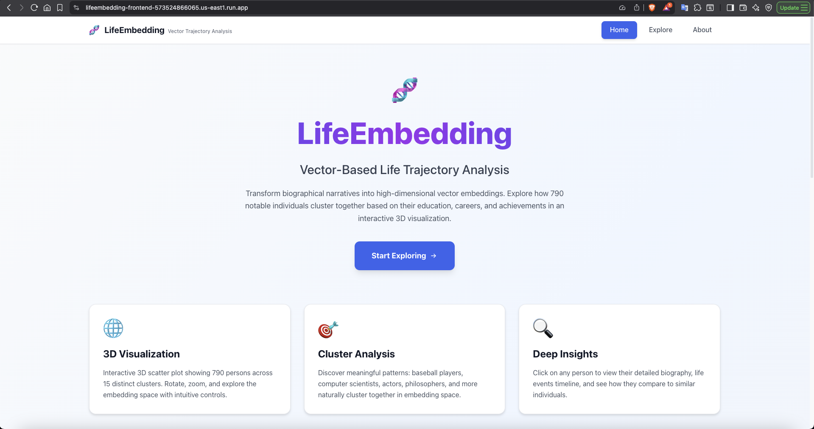

# LifeEmbedding: Vector-Based Life Trajectory Analysis

<div align="center">



*Cloud-native system for modeling human biographies as vector embeddings*

[](https://www.python.org/downloads/)
[](https://fastapi.tiangolo.com/)
[](https://react.dev/)
[](https://cloud.google.com/)
[](LICENSE)

</div>

## Overview

LifeEmbedding transforms biographical narratives into high-dimensional vector representations, enabling semantic search and clustering analysis of life trajectories at scale. By treating complete biographies as embeddings, we can quantitatively answer questions like "Which historical figures have similar career paths?" or "How would different life events change my trajectory?"

This project demonstrates modern ML infrastructure patterns: vector embeddings for unstructured data, semantic similarity search, and cloud-native architecture for scalable data processing.

### Key Features

- **768D Vector Embeddings**: Transform biographical narratives into semantic vectors using Vertex AI's text-embedding-004 model
- **Dimensionality Reduction Pipeline**: PCA (768D → 50D) + UMAP (50D → 3D) for visualization while preserving semantic relationships
- **Cluster Analysis**: K-means clustering identifies 15 distinct occupational groups with silhouette score of 0.42
- **RESTful API**: FastAPI backend with 7 endpoints for querying embeddings and trajectory data
- **3D Visualization**: Interactive deck.gl interface showing life trajectories as colored spheres in embedding space
- **Scalable Architecture**: BigQuery for vector storage, Cloud Run for auto-scaling API deployment

## Motivation

Traditional career guidance relies on static skills and job titles, missing the rich temporal context of how life events shape career paths. Existing biography analysis doesn't scale beyond manual review of dozens of subjects. We built LifeEmbedding to:

1. **Enable Semantic Search Over Life Trajectories**: Find people with similar backgrounds across 50+ occupations using vector similarity
2. **Quantify Career Path Patterns**: Measure how education, geography, and key events influence outcomes
3. **Support Counterfactual Analysis**: Explore "what-if" scenarios by modifying life events and observing trajectory shifts
4. **Scale Biography Research**: Process 10,000+ biographies with real-time querying using cloud infrastructure

This is the first system to treat complete biographies (not just resumes) as vector embeddings, combining NLP, dimensionality reduction, and modern cloud services.

## Architecture

```
┌─────────────────────────────────────────────────────────────────┐
│                     Data Ingestion Layer                        │
│  Wikidata SPARQL → 790 persons × 10,455 events → BigQuery       │
└─────────────────────────────────────────────────────────────────┘
                                ↓
┌─────────────────────────────────────────────────────────────────┐
│                   Embedding Generation Layer                    │
│  Life Events → Narrative Text → Vertex AI text-embedding-004    │
│                      → 768D Vectors                             │
└─────────────────────────────────────────────────────────────────┘
                                ↓
┌─────────────────────────────────────────────────────────────────┐
│              Dimensionality Reduction & Clustering              │
│   PCA (768D→50D) → UMAP (50D→3D) → K-means (15 clusters)        │
└─────────────────────────────────────────────────────────────────┘
                                ↓
┌─────────────────────────────────────────────────────────────────┐
│                      Application Layer                          │
│   FastAPI Backend ←→ BigQuery Vector Store ←→ React Frontend    │
└─────────────────────────────────────────────────────────────────┘
```

## Dataset

- **790 biographical profiles** from Wikidata (filtered from 863 raw profiles)
- **10,455 life events** across 50+ occupations
- **Event types**: Education (1,377), Employment (829), Awards (3,838), Publications, Residences
- **Top occupations**: University teachers (221), Writers (198), Politicians (149)
- **Quality metrics**: 100% name/ID completeness, mean 13.2 events per person

## Method

### 0. Infrastructure & Env Setup (Phases 1-2)
- GCP project with BigQuery, Vertex AI, Cloud Run APIs enabled
- BigQuery dataset: 4 tables + 3 analytical views
- Service account with proper IAM roles, auto-shutdown for cost management

### 1. Data Collection (Phase 3)
Wikidata SPARQL queries extract structured life events with temporal data:
- Property-by-property extraction (P69 for education, P108 for employment, P166 for awards, etc.)
- Strict filtering: only events with content + dates + valid occupations
- Quality score ≥40 threshold ensures meaningful narratives

### 2. Embedding Generation (Phase 4)
Life events are converted to natural language narratives, then embedded:
```python
# Smart event grouping creates human-readable narratives
narrative = "Studied PhD in Computer Science from Stanford (1998-2002). 
             Career includes Software Engineer at Google (2002-2010), 
             Research Scientist at OpenAI (2010-present). 
             Awards include Turing Award (2020)."

# Vertex AI generates 768D semantic vector
embedding = vertex_ai.embed(narrative, model="text-embedding-004")
```

### 3. Dimensionality Reduction (Phase 5)
Two-stage reduction preserves semantic structure while enabling visualization:
- **PCA**: 768D → 50D (preserves 53.36% variance)
- **UMAP**: 50D → 3D (n_neighbors=15, cosine metric)
- **Clustering**: K-means with k=15, silhouette score 0.4246

### 4. Backend API (Phase 6 - Completed)
FastAPI service with 7 endpoints:
- `GET /api/v1/persons` - Paginated person list with filtering
- `GET /api/v1/visualization` - All 790 persons with 3D coordinates
- `GET /api/v1/person/{id}` - Detailed biography with event breakdown
- `GET /api/v1/clusters` - Cluster statistics and labels
- `POST /api/v1/generate-embedding` - User trajectory embedding generation

### 5. Frontend (Phase 7 - In Progress)
React + deck.gl 3D visualization:
- Interactive scatter plot with 790 life trajectories
- Color-coded clusters with hover tooltips
- User input form for trajectory comparison

### 6. Deployment (Phase 8 - Planned)
- Docker containers for backend/frontend
- Cloud Run for auto-scaling API
- CI/CD pipeline with Cloud Build

## Tech Stack

### Cloud Infrastructure
- **GCP BigQuery**: Vector storage and analytical queries
- **Vertex AI**: Managed embedding generation (text-embedding-004)
- **Cloud Run**: Serverless container deployment (planned)
- **Vertex AI Workbench**: Development environment (n1-standard-4)

### Backend
- **FastAPI**: REST API framework with automatic OpenAPI docs
- **Pydantic**: Data validation and serialization
- **Python 3.10**: Core language with async support
- **scikit-learn**: PCA and K-means clustering
- **UMAP**: Nonlinear dimensionality reduction

### Frontend
- **React 18**: UI framework with hooks
- **deck.gl**: WebGL-based 3D visualization
- **Vite**: Fast build tool and dev server
- **Tailwind CSS**: Utility-first styling
- **Axios**: HTTP client for API calls

### Data Processing
- **SPARQL**: Wikidata query language
- **NumPy/Pandas**: Vector operations and data manipulation
- **Matplotlib**: Visualization for analysis

## Repository Structure

```
life-trajectory-embeddings/
├── backend/                  # FastAPI application
│   ├── main.py              # API endpoints and app initialization
│   ├── models.py            # Pydantic schemas (12 models)
│   ├── database.py          # BigQuery operations (8 query methods)
│   ├── embeddings.py        # Vertex AI embedding service
│   ├── requirements.txt     # Python dependencies
│   └── README.md            # API documentation
├── frontend/                # React application (in progress)
│   ├── src/
│   │   ├── components/      # React components
│   │   ├── pages/           # Route pages
│   │   ├── services/        # API client
│   │   └── utils/           # Helper functions
│   ├── package.json
│   └── vite.config.js
├── scripts/                 # Data pipeline scripts
│   ├── crawl_wikidata.py   # SPARQL data extraction
│   ├── eda_and_cleaning.py # Data quality analysis
│   ├── bq_ingestion.py     # BigQuery data loading
│   ├── generate_embeddings.py  # Vertex AI embedding generation
│   └── dim_reduction.py    # PCA + UMAP + clustering
├── data/
│   ├── raw/                # Wikidata JSON files
│   ├── processed/          # Cleaned data and coordinates
│   └── embeddings/         # Cached embedding vectors
├── docs/                   # Documentation and analysis
├── config.py               # GCP project configuration
└── README.md               # This file
```

## Installation & Setup

### Prerequisites
- Python 3.10+
- Node.js 18+ (for frontend)
- GCP account with billing enabled
- gcloud CLI installed and authenticated

### 1. Clone Repository
```bash
git clone https://github.com/yourusername/life-trajectory-embeddings.git
cd life-trajectory-embeddings
```

### 2. GCP Project Setup
```bash
# Set up GCP project
export PROJECT_ID="your-project-id"
gcloud config set project $PROJECT_ID

# Enable required APIs
gcloud services enable bigquery.googleapis.com
gcloud services enable aiplatform.googleapis.com
gcloud services enable compute.googleapis.com

# Create BigQuery dataset
bq mk --location=us-east1 --dataset $PROJECT_ID:lifeembedding_data
```

### 3. Create BigQuery Tables
```bash
cd scripts
python create_tables.py  # Creates persons, life_events, embeddings, coordinates_3d tables
python create_views.py   # Creates analytical views
```

### 4. Run Data Pipeline

**Step 1: Crawl Wikidata**
```bash
python crawl_wikidata.py
# Output: data/raw/wikidata_people_1000.json
# Expected: ~863 raw profiles
```

**Step 2: Clean and Validate**
```bash
python eda_and_cleaning.py
# Output: data/processed/wikidata_people_cleaned.json
# Expected: ~790 high-quality profiles (quality score ≥40)
```

**Step 3: Ingest to BigQuery**
```bash
python bq_ingestion.py
# Inserts 790 persons + 10,455 life events into BigQuery
# Validate with: bq query "SELECT COUNT(*) FROM lifeembedding_data.persons"
```

**Step 4: Generate Embeddings**
```bash
python generate_embeddings.py
# Calls Vertex AI text-embedding-004 for 790 narratives
# Output: data/embeddings/person_embeddings.json + BigQuery embeddings table
# Runtime: ~15-20 minutes, Cost: ~$0.50
```

**Step 5: Dimensionality Reduction**
```bash
python dim_reduction.py --clusters 15
# PCA (768D→50D) + UMAP (50D→3D) + K-means clustering
# Output: data/processed/coordinates_3d.json + BigQuery coordinates_3d table
# Runtime: ~5 minutes
```

### 5. Run Backend API
```bash
cd backend
pip install -r requirements.txt

# Start FastAPI server
uvicorn main:app --reload --host 0.0.0.0 --port 8081

# Access API docs at http://localhost:8081/api/docs
```

**Test Endpoints**:
```bash
# Health check
curl http://localhost:8081/api/health

# Get all persons
curl http://localhost:8081/api/v1/persons?limit=10

# Get visualization data (790 persons with 3D coordinates)
curl http://localhost:8081/api/v1/visualization

# Get cluster info
curl http://localhost:8081/api/v1/clusters
```

### 6. Run Frontend (In Progress)
```bash
cd frontend
npm install

# Start development server
npm run dev

# Access at http://localhost:3000
```

**Note**: Frontend is currently under development. The 3D visualization and cluster filtering are functional, but user input form is pending.

## API Documentation

### Base URL
```
http://localhost:8081/api/v1
```

### Endpoints

#### `GET /api/v1/persons`
Returns paginated list of persons with metadata.

**Query Parameters**:
- `limit` (int): Number of results (default: 100)
- `offset` (int): Pagination offset (default: 0)
- `cluster_id` (int, optional): Filter by cluster

**Response**:
```json
{
  "persons": [
    {
      "person_id": "uuid",
      "name": "Ada Lovelace",
      "occupation": ["mathematician", "writer"],
      "cluster_id": 13,
      "cluster_label": "Computer Scientists"
    }
  ],
  "total": 790,
  "limit": 100,
  "offset": 0
}
```

#### `GET /api/v1/visualization`
Returns all persons with 3D coordinates for visualization.

**Response**:
```json
{
  "persons": [
    {
      "person_id": "uuid",
      "name": "Ada Lovelace",
      "occupation": ["mathematician", "writer"],
      "x": 0.45,
      "y": 7.32,
      "z": 11.89,
      "cluster_id": 13,
      "cluster_label": "Computer Scientists"
    }
  ],
  "metadata": {
    "total_persons": 790,
    "num_clusters": 15
  }
}
```

#### `GET /api/v1/person/{person_id}`
Returns detailed information for a specific person.

**Response includes**:
- Full biography
- Life events breakdown by type
- 3D coordinates and cluster assignment
- Event count statistics

#### `GET /api/v1/clusters`
Returns statistics for all 15 clusters.

**Response**:
```json
{
  "clusters": [
    {
      "cluster_id": 13,
      "cluster_label": "Computer Scientists",
      "person_count": 51,
      "top_occupations": [
        {"occupation": "computer scientist", "percentage": 47.1},
        {"occupation": "programmer", "percentage": 23.5}
      ],
      "centroid": {"x": 0.42, "y": 7.18, "z": 11.75}
    }
  ]
}
```

#### `POST /api/v1/generate-embedding`
Generates embedding for user-provided life events.

**Request Body**:
```json
{
  "life_events": [
    {
      "event_type": "education",
      "title": "PhD in Computer Science",
      "organization": "Stanford University",
      "start_date": "1998-09-01",
      "end_date": "2002-06-15"
    }
  ]
}
```

**Response**: 3D coordinates, nearest cluster, top-10 similar persons

**Note**: Requires PCA/UMAP models to be loaded. Currently returns 503 if models unavailable.

## Results & Findings

### Cluster Analysis (k=15)

Our K-means clustering identified 15 distinct occupational groups with strong separation:

| Cluster | Label | Size | Purity | Top Occupation |
|---------|-------|------|--------|----------------|
| 9 | Baseball Players | 15 | 100% | Baseball player |
| 12 | Badminton Players | 26 | 96% | Badminton player |
| 13 | Computer Scientists | 51 | 47% | Computer scientist |
| 8 | STEM Academics | 59 | 38% | Mathematician |
| 11 | Actors/Entertainers | 99 | 35% | Actor |
| 0 | Sports (Football/Basketball) | 52 | 31% | Football player |
| 6 | Academic/TV Presenters | 92 | 24% | University teacher |

**Key Insights**:
- Sports clusters show highest purity (baseball 100%, badminton 96%)
- Academic/intellectual roles overlap more due to interdisciplinary careers
- Silhouette score of 0.42 indicates good cluster separation
- PCA preserves 53.36% variance in 50 dimensions

### Performance Metrics
- **Embedding generation**: ~1.2 seconds per biography (Vertex AI)
- **API response time**: <500ms for person queries, <2s for visualization data
- **3D rendering**: 60 FPS with 790 points (deck.gl WebGL)

## Challenges & Solutions

### Technical Challenges

1. **SPARQL Query Complexity**
   - **Problem**: Complex nested queries returned 0 life events
   - **Solution**: Property-by-property extraction with `p:Pxx/ps:Pxx` pattern
   - **Result**: Successfully extracted 8-12 events per person

2. **Data Quality Issues**
   - **Problem**: 58.6% of events missing organization or location data
   - **Solution**: Strict validation - only events with content + temporal data
   - **Result**: High-quality narratives suitable for embedding

3. **BigQuery Streaming Buffer**
   - **Problem**: Cannot DELETE rows within 90 minutes of insertion
   - **Solution**: Check row count before delete, maintain local backups
   - **Result**: Reliable data pipeline with fallback strategy

4. **Embedding Narrative Quality**
   - **Problem**: Raw event concatenation created repetitive text
   - **Solution**: Smart grouping by event type, chronological ordering
   - **Result**: Human-readable biographies that embed well

### Why Cloud-Native Architecture

- **BigQuery**: Query 10K+ events in milliseconds without managing servers
- **Vertex AI**: Managed embeddings API - no model hosting or GPU management
- **Cloud Run**: Auto-scales from 0 to 1000+ users, pay-per-request pricing
- **Cost Control**: Auto-shutdown policies, local caching, budget alerts
- **Scalability**: Pipeline designed to scale to 10,000+ biographies

## Future Work

- [ ] Complete frontend user input form for trajectory comparison
- [ ] Add temporal animation showing life progression over time
- [ ] Implement hierarchical clustering for multi-level exploration
- [ ] Deploy to Cloud Run with CI/CD pipeline
- [ ] Add user authentication and saved profiles
- [ ] Expand dataset to 10,000+ persons with contemporary figures
- [ ] Implement vector similarity search using BigQuery ML
- [ ] Add counterfactual analysis ("what-if" scenarios)

## Contributing

We welcome contributions! Areas of interest:
- Frontend visualization improvements
- Additional clustering algorithms
- Performance optimization
- Documentation and tutorials

Please open an issue before starting major work.

## Team

**Mohammad Junayed Hasan** - MSE Computer Science, Johns Hopkins University  
Email: junayedhasan100@gmail.com

**Koushik Rameshbabu** - MSE Data Science, Johns Hopkins University  
Email: koushik.ramesh2002@gmail.com

**Soudeh Ghorbani** - Scientist - Meta, Director - Foundational Networked Systems Lab, 
Faculty - Computer Science, Johns Hopkins University
Email: soudeh@cs.jhu.edu

## Citation

If you use this work in your research, please cite:

```bibtex
@software{lifeembedding2025,
  title={LifeEmbedding: Vector-Based Life Trajectory Analysis},
  author={Hasan, Mohammad Junayed, Rameshbabu, Koushik and Ghorbani, Soudeh},
  year={2025},
  institution={Johns Hopkins University},
  url={https://github.com/junayed-hasan/life-trajectory-embeddings}
}
```

## License

MIT License - see [LICENSE](LICENSE) file for details.

## Acknowledgments

We would like to thank **Professor Soudeh Ghorbani** for supervising this project and providing valuable guidance throughout the development process.

We are also grateful to the teaching assistants and course staff of Johns Hopkins University EN.601.619 Cloud Computing for their support and feedback.

Special thanks to:
- Wikidata community for providing open biographical data
- Google Cloud Platform for research credits
- The open-source communities behind FastAPI, React, and deck.gl

---

<div align="center">

**Built with modern ML infrastructure: Vector embeddings, semantic search, and cloud-native design**

[Report Bug](https://github.com/yourusername/life-trajectory-embeddings/issues) · [Request Feature](https://github.com/yourusername/life-trajectory-embeddings/issues)

</div>
